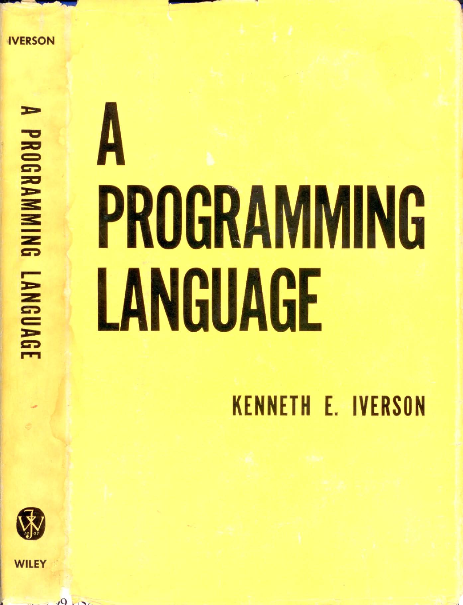
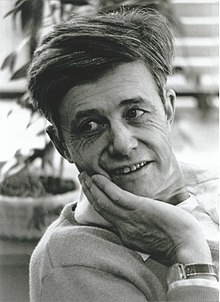

# APL
## A Primer

---

???

# APL programming language
# Named after a "A Programming Language"
# Kenneth E. Iverson

---

???

# Kenneth E. Iverson
# 17 December 1920 &emdash 19 October 2004
# Graduated Harvard
# Assistant Professor 

---

> These machines are going to be immensely important for business, and I want you to prepare and teach a course in business data processing.

--

<!-- -->

> He was "appalled" to find that conventional mathematical notation failed to fill his needs, and began work on extensions to the notation that were more suitable
